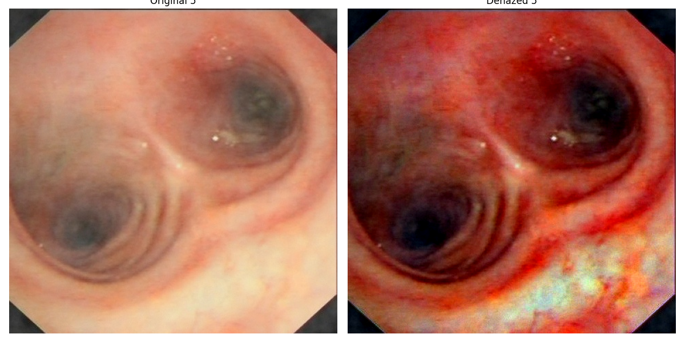

# Single Image Dehazing Techniques

This repository showcases advanced methods for single image dehazing, aimed at enhancing visibility in hazy or foggy conditions. It includes implementations of three key algorithms designed to restore image clarity effectively:

1. **Luminance Blending (Luo et al.)** - A method that improves visibility by manipulating luminance levels, primarily focused on applications like endoscopic video defogging. This technique was introduced in the paper *Luminance Blending for Endoscopic Video Defogging*.

2. **Luminance Blending with BCCR** - An enhanced version of Luminance Blending, integrating Bright Channel Prior (BCCR) for more effective contrast restoration and haze removal.

3. **FFANet for Single Image Dehazing** - A state-of-the-art neural network that leverages feature fusion and attention mechanisms to accurately remove haze from single images. This is based on the work *FFA-Net: Feature Fusion Attention Network for Single Image Dehazing* by Luo et al.


---

## Usage

To get started, clone the repository and install the required dependencies:

```bash
# Clone the repository
git clone https://github.com/gaurav-bhardwaj29/FFANet.git
cd FFANet

# Install dependencies
pip install -r requirements.txt

# Run the dehazing process
python main.py --input data/hazy_images --output results/
```


---

## Results

Results generated by the algorithms will be displayed here:

### R2 output

### FFANet Output


---

## References

- Luo, et al. [*Luminance Blending for Endoscopic Video Defogging*](https://pmc.ncbi.nlm.nih.gov/articles/PMC6952256/).
- [*FFA-Net: Feature Fusion Attention Network for Single Image Dehazing*](https://arxiv.org/abs/1911.07559/).

---

## License

This project is licensed under the Apache-2.0 License. For more details, refer to the [LICENSE](LICENSE) file.
